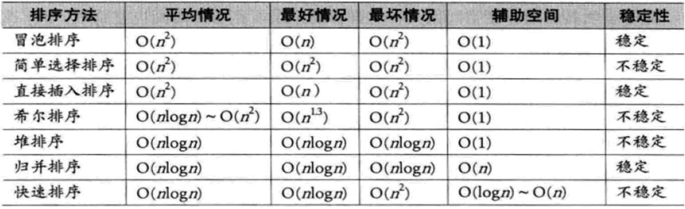

# 数据结构期末复习


《数据结构与程序设计》期末考试须知

一、 考试安排

考试时间：2023 年 6 月 18 日（17 周周日）14：00-17：00。请提前 30 分钟 到场准备（准备考试环境、完成身份核验）。

考试地点：沙河校区教 3 阶梯大教室、沙河主楼 B 座 5 层机房、学院路北区负 1 层 B 区）。每个学生具体考试地点见本通知附件。

二、 考试形式

通过 judge 平台进行在线考试。只能使用 Google Chrome，360 极速或 Firefox 浏览器登录考试平台。考前务必安装好客户端，否则无法考试。

三、 考试题型

1. 选择及填空题：20 道题，共 15 分。 2. 编程题：3 道题 ，基本题 15 分，简单应用题 12 分，应用题 8 分，共 35 分。

四、 考试要求

1. 学生应遵守北京航空航天大学相关考试要求，并携带好本人身份证明或学生 卡参加考试。考前，请将手机关闭并和包一起放到考场指定位置（考试期间 查看手机将按作弊处理）。
2. 学生使用自备笔记本电脑或者机房电脑进行考试，若使用自备笔记本电脑考 试，考前应给电脑充满电，并务必携带外接电源设备参加考试。机房考试的 同学，只允许打开一台计算机进行考试（不允许同时打开笔记本电脑和台式
   机）。考试期间禁止使用优盘等外接存储设备。
3. **学生自备草稿纸（只能携带空白纸）。**
4. 开卷考试，考试期间只能查阅：数据结构教程（唐发根编著）、C 程序设计导引（尹宝林编著））教材和本课程下发、及**本人产生的电子资料**
   。使用机房计算机考试的同学，请到机房后在考试开始前将考试允许的相关电子资料考进机房计算机，正式开考时不允许往计算机中拷贝任何资料。
5. 考试将全程监控，未经监考老师同意，不得自行更换机器，一个帐号在多个 机器上登录，或者一个机器上登录多个帐号（即：以其他同学帐号登录），或 者打开使用蓝牙都以作弊处理。
6. 如果考试期间出现个人电脑电量不足，不能支撑到考试结束，请及时向监考 老师报告，调换到具有外接电源的座位继续考试。如果考试期间个人电脑遇 到故障，无法进行考试，请及时向监考老师报告，调换到机房机位，利用机房电脑进行考试。

## 选择填空部分

### 图


### 查找和排序

二分查找是重头戏


## 编程题思路部分

### 常用的ADT快速实现

```C
// Queue

ElementType queue[MAX_QUEUE_ELEMENT_NUM];
// 初始化
int front, rear;
front = 0;
rear = MAX_QUEUE_ELEMENT_NUM - 1;
// int count = 0;

// EnQueue
// if(count != MAX_QUEUE_ELEMENT_NUM)
rear = (rear + 1)%MAX_QUEUE_ELEMENT_NUM;
queue[rear] = X;
count++;
// DeQueue
// if(count != 0)
ElementType tmp = queue[front];
queue[front] = 0;
count--;
front = (front + 1)% MAX_QUEUE_ELEMENT_NUM;
return tmp;


// Stack

ElementType stack[MAX_STACK_ELEMENT_NUM];
int TopOfStack = -1;

// push
stack[++TopOfStack] = X;
// pop
X = stack[TopOfStack--];
```

一些重要的算法简直必考：栈的表达式计算、树的插入删除和表达式

关于通用数据结构，很可能会考验速度写出一个栈或链表

ADT是最底层的抽象层级，除此以外，常用排序、数据结构的应用也都需要可以被调用（如重要常见作业）

树的求高度问题

**文件的输入输出！！！！！！**

排序的稳定性


哈夫曼树在考察范围内！（不过我猜是选择填空）

查找算法

```C
// binary
int binsearch(keytype key[], int n, keytype k)
{
int low=0, high=n-1, mid;
while (low<=high){
mid=(low+high)/2;
if (k==key[mid])
return mid;             /*  查找成功  */
if (k>key[mid])
low=mid+1;            /*  准备查找后半部分 */
else
high=mid–1;           /* 准备查找前半部分 */
}
return -1;                             /*   查找失败  */
}

int binsearch2(keytype key[], int low, int high, keytype k)
{
int mid;
if (low>high)
return -1;
else{
mid=(low+high)/2;
if (k==key[mid])
return mid;
else
if (k<key[mid])
return binsearch2(key, low, mid–1, k);
else
return binsearch2(key, mid+1, high, k);
}
}
```

文件输入输出

```C

```

## 作业答案

### 图


### 查找和排序


### 树


### 栈和队


